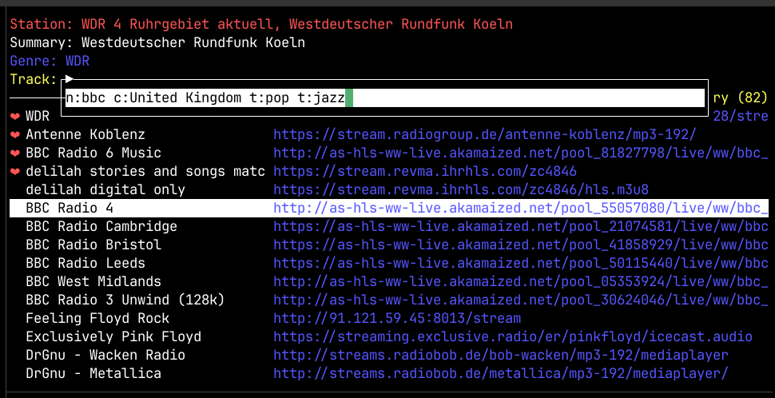

# Radio Go Go



    All we heard is radio ga ga
    Radio goo goo

    - Queen

Terminal based radio player that uses the [Radio Browser][radiobrowser] API to
search for internet radio stations and [`mpv`][mpv] to play the streams. I was
inspired by [Tera][tera] and I use this project as an excuse to learn
[Golang].

[mpv]: https://mpv.io
[radiobrowser]: https://www.radio-browser.info
[tera]: https://github.com/shinokada/tera
[golang]: https://go.dev

## Install
1. Install `mpv`
1. Clone this repository
1. Start the program using `go run .`
1. Type "?" for key map and search syntax


## Errors
1. Radio Go Go will keep searching for Radio Browser servers until it gets a 
   list of them. Without at least one server station search is disabled.
1. Sometimes a Radio Browser server is flaky and will return corrupt results.  
   Just hit ENTER again to search

## User data
Played and favorite stations are stored as `stations.json` under
`$XDG_DATA_HOME` if it is set or `.local/share/radio-gogo/`

Played songs (metadata as reported by the station stream) are saved in
`songs.txt` in the same directory.

The log is saved in log.txt (but may be moved to `$` in a future version)

# Code

## Run tests

```
go test -v ./...
```

## Data structures and algorithms

Internally we keep two lists of stations.

1. History
1. Search result

Stations are added to the history when they are played or added to favorites
without playing. 


# Learning goals

1. goroutines and communication between goroutines
1. Sockets (communicate with mpv)
1. Networking basics
1. TUIs

# Learning notes

## The magic of json Decode
`json` decoding is uncharacteristically marvelous in `golang`. Saving and 
loading (marshaling and unmarshaling) objects is very smooth and resilient.  
There were two features I really liked and both are used in (internal/mpv.go) 
and they made the code _much more compact._

## Struct field tags
Like in Python and other modern languages a struct can be serialized to `JSON` 
with the struct attribute names set as the `JSON` keys. What happens when the 
`JSON` name is different from the struct name? 

For example, when I retrieve the stream metadata from `mpv` it returns the 
station name as `icy-name` whereas I'd like to use just `Name`. Do I have to 
write a boring boiler plate function to copy the unmarshaled data to my struct?  
Happily, no.

`golang` has a feature called "struct tags" and the golang json library can use 
the struct tags to translate between an "on disk" attribute and in "in code" 
attribute.

So, my metadata struct for getting information from `mpv` looks like this

```
type MpvMetadata struct {
	Name        string `json:"icy-name"`
	Description string `json:"icy-description"`
	Genre       string `json:"icy-genre"`
	Title       string `json:"icy-title"`
}
```

1. https://go.dev/ref/spec#Tag
2. https://go.dev/wiki/Well-known-struct-tags


I also use this for the command struct sent to `mpv` as well, since `mpv` is 
fussy about capitalization and won't accept `Command` instead of `command` in 
the JSON-IPC call we make to it.

```
type MpvRequest struct {
	Command    []string `json:"command"`
	Request_id int      `json:"request_id"`
}
```
## `json.RawMessage` type
The response from mpv contains a nested structure. There are two fixed fields 
and one field whose structured contents vary based on the command. Do I have to 
write different unmarshal functions for each command then? No. We use the 
`rawMessage` type.

```
type MpvResponse struct {
	Request_id int
	Data       json.RawMessage
	Error      string
}
```

This tells the unmarshal function to hold off trying to parse the `Data` field 
until later.


## `defer`


## Composition (struct embedding)

## Custom sorting


# Design decisions: Focus on simplicity

I decided to make a simple app that looks nice (to me).

I initially thought about a tag search, and a station search and so on. But I 
always liked the (original) Google search page the most. Just a simple text box 
where you type in your terms and get results and behind that is a more 
sophisticated search language if you want it.

_I decided to have a single search bar where typing a string does a tag search.  
If you add search directives, it does a more detailed search._

I had initially planned a "responsive" program, where, for example, you could be 
typing a search term and the search results would populate as you typed. This 
would probably be cool, but it brought with it some technical and UX issues.  
What happens if you type a search term, move to the search results and highlight 
something and then more search results come in? Asynchronous events make things 
very complicated.

_I decided search is a blocking action. The UI is not actually blocked: You can 
do a new search while the old search is running (which overwrites the old 
search) or quit the app, but you get the search results in one go. This
simplifies the UX as well as the code and in practice, unless you search an 
empty string and get all 40000 odd stations back, it's snappy enough._

# Design decisions: Least dependencies

I did a silly [console game](github.com/kghose/pinman) using `nsf/termbox-go` 
and liked what I saw there. I especially liked that nsf/termbox-go has few 
dependencies but it would be a lot of work to expand that to a TUI. rivo/tview 
hit the right spot: it is well featured and keeps its deps to within a certain 
circle of what I'd consider well used and stable code. 

`nsf/termbox-go` is small enough to vendor in, `rivo/tview` is larger, but still 
feasible to vendor in.

